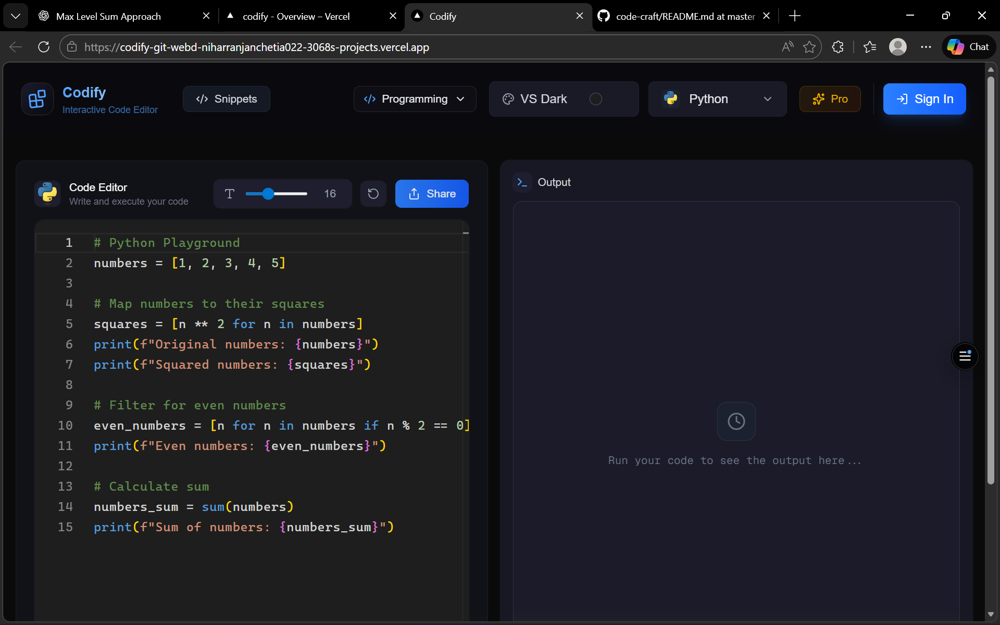
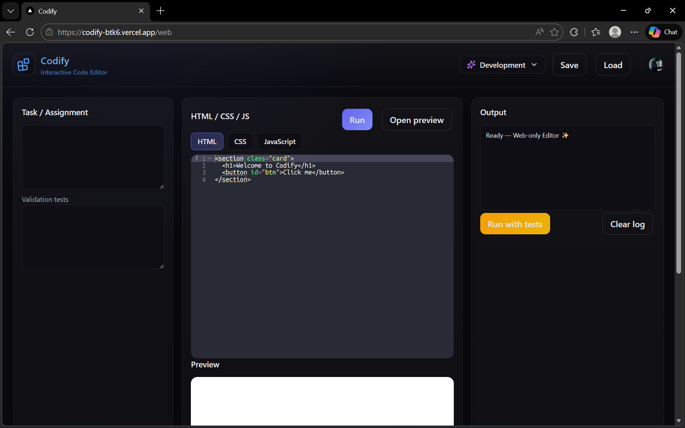

# 🚀 Codify — Interactive Code Editor

Codify is a modern, browser-based **interactive code editor** built with **Next.js (App Router)**.  
It provides a clean, IDE-like experience for **programming practice** and **web development**, all inside the browser.

🔗 **Live Website:**  
👉 https://codify-btk6.vercel.app/

---

## 🖥️ Screenshots

### 🔹 Programming Mode (`/`)
A general-purpose programming playground with language support, themes, and execution.



---

### 🔹 Development Mode (`/web`)
A full **HTML / CSS / JavaScript** editor with live preview, testing, and persistence.



---

## ✨ Features

- 🧠 **Dual Mode Interface**
  - **Programming Mode** (`/`)
  - **Development Mode** (`/web`)
- ✍️ **Ace Editor Integration**
  - Syntax highlighting
  - Keyboard shortcuts
  - Multiple languages
- ▶️ **Live Code Execution**
- 🧪 **Run with Validation Tests**
- 💾 **Save & Load Projects**
  - LocalStorage persistence
  - JSON export / import
- 🎨 **Dark Theme UI**
- 🔄 **Reliable Navigation**
  - Hard refresh for Programming mode
  - SPA navigation for Development mode

---

## 🛠️ Tech Stack

- **Framework:** Next.js (App Router)
- **Language:** TypeScript
- **Editor:** Ace Editor (CDN)
- **Styling:** CSS Modules + Utility Classes
- **Icons:** lucide-react
- **State Management:** React Hooks
- **Storage:** Browser `localStorage`
- **Deployment:** Vercel

---
### Setup .env file

```js
NEXT_PUBLIC_CLERK_PUBLISHABLE_KEY=
CLERK_SECRET_KEY=
CONVEX_DEPLOYMENT=
NEXT_PUBLIC_CONVEX_URL=
```

### Add these env to Convex Dashboard

```js
CLERK_WEBHOOK_SECRET=
LEMON_SQUEEZY_WEBHOOK_SECRET=
```

### Run the app

```shell
npm run dev
```
---
## 📂 Project Structure

```text
CODIFY/
├─ .next/
├─ convex/
├─ node_modules/
├─ public/
├─ src/
│  ├─ app/
│  │  ├─ (root)/
│  │  │  ├─ _components/
│  │  │  ├─ _constants/
│  │  │  └─ page.tsx
│  │  ├─ pricing/
│  │  ├─ profile/
│  │  ├─ snippets/
│  │  ├─ web/
│  │  ├─ favicon.ico
│  │  ├─ globals.css
│  │  └─ layout.tsx
│  ├─ components/
│  ├─ hooks/
│  ├─ store/
│  ├─ types/
│  └─ proxy.ts
├─ .env.local
├─ .gitignore
├─ eslint.config.mjs
├─ next-env.d.ts
├─ next.config.ts
├─ package-lock.json
├─ package.json

